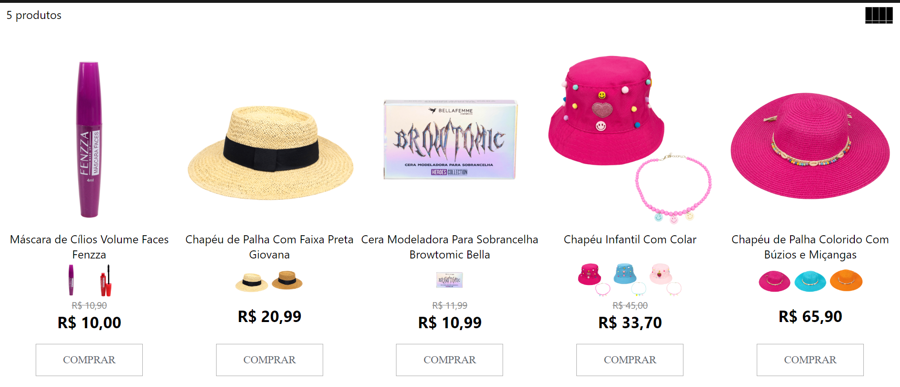
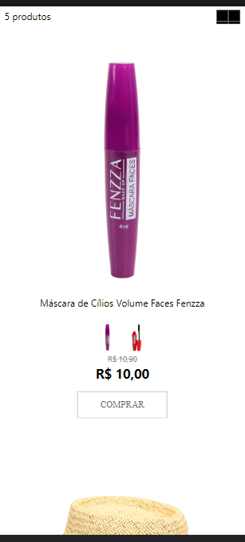

Desafio 1

O desafio propõe a construção de uma VITRINE de produtos RESPONSIVA, a partir do consumo de uma API utilizando somente as tecnologias HTML, CSS e JavaScript. Simples assim!

API

As informações dos produtos estão sendo retornadas da API do desafio:
API de Resultado: desafio.xlow.com.br/search
Nela você terá um array de produtos, e os detalhes de cada um em
API de Produto: desafio.xlow.com.br/search/:productid
lá você terá informações especificas de cada produto

Estrutura da página

1 - Ter um contador com o número de produtos retornados
2 - Ter um botão que altere a quantidade de produtos por linha ao ser clicado, exemplo:
No mobile de 1 produto para 2 por linha (vice-versa) e no desktop de 4 para 5 (vice-versa)
Sobre vitrine de produtos

Estrutura da Vitrine

Imagem
Nome
Imagens das variações do produto
AÇÃO: ao clicar na imagem, trocar para imagem principal
preço
Com preço com desconto destacado visualmente caso haja desconto
Sobre botão de comprar
Não precisa ter ações ao clicar, a página não precisa ir para outro local

Imagem de referência

Tecnologias permitidas neste desafio
HTML5
CSS3
ECMAScript 6
Jquery (opcional)