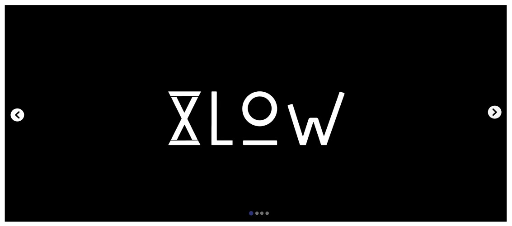

# Desafio 2

O desafio propõe a criação de um Slider de imagens em React que possui rolagem infinita, rolagem automatica e também contenha setas para navegar entre as imagens a esquerda e a direita da imagem atual. Além disso, o Slider também deve conter bolinhas clicáveis para navegar entre as imagens.

## Imagens

As imagens a aparecem no Slider devem conter

- Texto alternativo(alt)
- Hyperlink

## Slider

As imagens deve ser adicionadas no Slider através de um array de objetos contendo as informações:

- URL
- ALT
- LINK

## Imagem de referência

## Tecnologias permitidas neste desafio

- HTML5
- CSS: CSS MODULES
- REACT

Observação: Não é permitido utilizar nenhuma biblioteca adicional além do react

## Entrega

Crie um repositório para o desafio e envie o link para contato do recrutamento.

No caso do desafio necessitar do uso de Yarn ou NPM para ser executado o repositório deve conter um arquivo "package.json" com as dependências e o comando "npm start" configurado corretamente